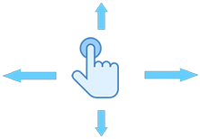

# **Команды Git**
## *Введение*
Осваивать Git проще в процессе редактирования текстовых файлов. Markdown  – язык разметки, который позволяет форматировать текст. Для написания в редакторе VS Code используется синтаксис языка. Все команды задаём при помощи написания кода в терминале. Прежде чем создавать репозиторий и инициализировать Git, проверим текущую установленную версию пограммы. Для этого в терминале введём команду:

__*git --version*__

Если Git установлен на компьютер, вы увидите его текущую версию. Программа использует мнемонические команды, которые легко запомнить, если знать английский язык.
#
## **Создание Git-репозитория:**
+ Берём локальный каталог, который не находится под версионным контролем, и превращаем его в репозиторий.
+ Клонируем существующий репозиторий из любого места.
#
## **Команда git init**
+ Инициализация: указываем папку, в которой git начнёт отслеживать изменения
+ В папке создаётся скрытая папка .git

#
## **Команда git status**
+ Показывает текущее состояние гита, есть ли изменения, которые нужно закоммитить (сохранить)
#
## **Команда git add**
+ Добавляет содержимое рабочего каталога  в индекс (staging area) для последующего коммита. Эта команда дается после добавления файлов. Писать название целиком не обязательно: терминал дозаполнит данные автоматически.

#
## **Команда git commit**
+ зафиксировать или сохранить

По умолчанию **git commit** использует лишь этот индекс, так что вы можете использовать **git add**  для сборки слепка вашего следующего коммита. 

Команда **git commit** берёт все данные, добавленные в индекс с помощью **git add**, и сохраняет их слепок во внутренней базе данных, а затем сдвигает указатель текущей ветки на этот слепок.

#
## **Команда git log**
+ Журнал изменений
+ Перед переключением версии файла в Git используйте команду git log, чтобы увидеть количество сохранений

#
## **Команда git checkout**
+ Переключение между версиями.
+ Для работы нужно указать не только интересующий вас коммит, но и вернуться в тот, где работаем, при помощи команды **git checkout master**.
#
## **Команда git diff**
+ Показывает разницу между текущим файлом и сохранённым
+ Перед переключением версии файла в Git используйте команду git log, чтобы увидеть количество сохранений

#
# **Приложение и примечания**

## *Примечания*
1. Чтобы вызвать ранее введённую команду, пользуемся стрелками на клавиатуре. Перебираем недавно введённые команды нажатием стрелки «вверх».
2. Чтобы вызвать ранее введённую команду, пользуемся стрелками на клавиатуре. Перебираем недавно введённые команды нажатием стрелки «вверх».
3. Git отслеживает файлы по имени! Если изменить имя файла, необходимо добавить файл с новый именем + __*git commit*__
## *Синтаксис языка Markdown.* 
+ Жирный текст — *
+ Курсивный текст — *
+ Зачеркнутый текст — ~
+ Выделяют заголовки — # в начале строки
+ Показать уровень заголовка — подчеркивание знаками = или ****
+ Нумерованные Списки — обозначаются обычными цифрами 1, 2, 3
+ Ненумерованные Списки — обозначаются *знаками в начале строки
+ Вложенные Списки — выполняем отступы
#
# **Подробная инструкция для работы с Markdown**
## **Выделение текста**

Чтобы выделить текст курсивом, необходимо обрамить его звёздочками **(*)** или знаком нижнего подчеркивания **( _ )**. Например, *вот так* или _вот так_.

Чтобы выделить текст полужирным, необходимо обрамить его двойными звёздочками **( ** )** или двойным знаком нижнего подчеркивания **( __ )**. Например, **вот так** или __вот так__.

Альтернативные способы выделения текста полужирным или курсивом нужны для того, чтобы мы могли совмещать оба этих способа. Например, _текст может быть выделен курсивом и при этом быть **полужирным**_.
#
## **Списки**

Чтобы добавить ненумерованные списки, необходимо пункты выделить звёздочками **( * )** или знаком **(+)**. Например, вот так:
* Элемент 1
* Элемент 2
* Элемент 3
+ Элемент 4

Чтобы добавить нумерованные списки, необходимо пункты просто пронумеровать. Например, вот так:
1. Первый пункт
2. Второй пункт
#
## **Работа с изображениями**

Чтобы вставить иозображение в текст, достаточно написать следующее:

#
## **Ссылки**
Чтобы добавить ссылку, необходимо использовать следующий синтаксис:

C информацией по добавлению ссылок в Markdown можно ознакомиться по ссылке [Название кнопки](Адрес ссылки)

Пример:

C информацией по добавлению ссылок в Markdown можно ознакомиться по ссылке [Использование ссылок в документации](https://learn.microsoft.com/ru-ru/contribute/how-to-write-links)
#
## **Работа с таблицами**

### *Создание таблиц в Markdown*
Таблица в Markdown может использоваться для представления сравнений данных пользователем.

Для создания таблицы в Markdown мы используем тире **(-)** и вертикальные полосы **( | )** для разделения строк и столбцов.

В первой строке таблицы мы строим заголовок, разделяя эту строку тремя или более дефисами **( --- )**, чтобы процессор Markdown понимал форматирование.

Разделение столбцов выполняется с помощью вертикальной черты **( | )**, которую программисты также называют __*pipe*__. Вывод отображается в HTML.

| Заголовок 1 | Заголовок 2 |
| --------- | --------- |
| Текст  | Текст  |
| Текст  | Текст  |

Вертикальные полосы **( | )** на концах стола используются чисто для косметических целей, то есть вы можете создать таблицу без боковых планок.

Пример:

Ширина ячеек в таблице Markdown может быть разной.

Пример:

### *Выравнивание*
Markdown позволяет выровнять содержимое столбца таблицы по левому, правому или центру.

Чтобы выровнять содержимое по левому краю в таблице Markdown, поместите двоеточие **( : )** перед дефисами **( --- )**, разделяющими строку заголовка.

Пример:

| Заголовок 1  | Заголовок 2 | Заголовок 3 |
| :---    | :----    | :---    |
| Текст   | Текст    | Текст   |
| Текст   | Текст    | Текст   |

>ПРИМЕЧАНИЕ: использование двоеточия для выравнивания текста по левому краю необязательно, поскольку по умолчанию содержимое таблицы уже выровнено в этой позиции.

Чтобы выровнять текст по правому краю в таблице Markdown, вставьте двоеточие **( : )** после тире **( --- )**, разделяющих строку заголовка.

Пример:

| Заголовок 1  | Заголовок 2 | Заголовок 3 |
| ---:    | ----:    | ---:    |
| Текст   | Текст    | Текст   |
| Текст   | Текст    | Текст   |

Чтобы выровнять содержимое столбца по центру в таблице Markdown, добавьте двоеточие **( : )** до и после тире, разделяющих строку заголовка.

Пример:

| Заголовок 1  | Заголовок 2 | Заголовок 3 |
| :---:    | :----:    | :---:    |
| Текст   | Текст    | Текст   |
| Текст   | Текст    | Текст   |

Стоит отметить, что выравнивание тире **( --- )** линии, разделяющей заголовки таблиц, не имеет значения для процессора Markdown, что действительно будет приниматься во внимание, так это положение двоеточия **( : )**.

В следующем примере тире **( --- )** расположены слева от столбца, и выравнивание работает равномерно.

Пример:

| Заголовок 1  | Заголовок 2 | Заголовок 3 |
| :---    | :----:    | ---:    |
| Текст   | Текст    | Текст   |
| Текст   | Текст    | Текст   |

>ПРИМЕЧАНИЕ: содержимое заголовка таблицы также будет выровнено в соответствии с положением двоеточия.

### *Форматирование текста в таблицах*
Вы можете вставить в таблицу несколько основных элементов Markdown.

Некоторые разрешенные форматы: создание links, выделение содержимого жирным шрифтом или курсивом и выделение текста как кода, однако принимается только онлайн-код, то есть когда он создается с открытием и закрытием обратных кавычек **( ` )**.

Заголовки, блоки кода, blockquotes, списки, горизонтальные линии, изображения и tags HTML не работают.

>ПРИМЕЧАНИЕ: вы даже можете найти приложения, которые допускают вставку упомянутых выше элементов в таблицу, но это ухудшит переносимость вашего документа, поскольку другие программы не поддерживают это.

### *Удаление вертикальных полос в таблицах*
Вы уже узнали, что для разделения столбцов таблицы мы используем вертикальную черту **( | )**.

Теперь, если вы собираетесь отображать тот же символ в качестве содержимого в ячейке, вы должны использовать кодировку HTML:

#
## **Цитаты**
Для обозначения цитат в языке Markdown используется знак «больше» **( > )**. Его можно вставлять как перед каждой строкой цитаты, так и только перед первой строкой параграфа. Также синтаксис Markdown позволяет создавать вложенные цитаты (цитаты внутри цитат). Для их разметки используются дополнительные уровни знаков цитирования **( > )**. Цитаты в Markdown могут содержать всевозможные элементы разметки. Цитаты в языке Markdown выглядят следующим образом:

>Это пример цитаты,
>в которой перед каждой строкой
>ставится угловая скобка.

>Это пример цитаты,
в которой угловая скобка
ставится только перед началом нового параграфа.

>Второй параграф.

Вложение цитаты в цитату выглядит следующим образом:

> Первый уровень цитирования
>> Второй уровень цитирования
>>> Третий уровень цитирования
>
>Первый уровень цитирования

Уровень цитирования не может превышать 15-й.
#
## **Заключение**
\
Язык разметки Markdown имеет множество особенностей и функций, которым можно найти самые разные способы применения. С более подробной информацией вы можете ознакомиться по ссылке:

 
